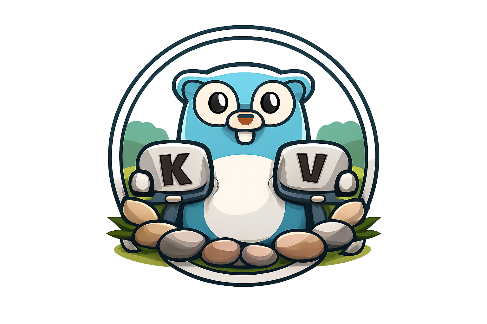

<p align="center">
  
</p>

<p align="center">
  A pure Go implementation of RocksDB with bit-compatible on-disk formats.
</p>

<div align="center">
  
[](https://pkg.go.dev/github.com/aalhour/rockyardkv)
[](https://goreportcard.com/report/github.com/aalhour/rockyardkv)
  
</div>

---

## Overview

<!-- RockyardKV is a Go-native, [RocksDB](https://rocksdb.org/)-compatible storage engine. -->
RockyardKV is a pure Go implementation of [RocksDB](https://rocksdb.org/).
It reads and writes RocksDB databases without CGo or C++ dependencies.

The project targets bit-compatible file formats with RocksDB. Files created by RockyardKV can be read by C++ RocksDB, and vice versa.

Built with a lot of respect for [RocksDB](https://github.com/facebook/rocksdb) - the foundational storage engine that inspired this work. No affiliation or endorsement implied.

> [!NOTE]
> **Project status:** Core storage operations work with verified format compatibility.
> Durability semantics are under active verification.
> Refer to [docs/status/](docs/status/README.md) for compatibility details and known limitations.

## Features

- **Storage:** LSM-tree with leveled, universal, and FIFO compaction; column families; snapshots; Bloom filters; Snappy, LZ4, Zstd, and Zlib compression
- **Write path:** Merge operators, range deletions, SST ingestion, write stall control
- **Transactions:** Optimistic and pessimistic modes with deadlock detection
- **Operations:** Backup engine, checkpoints, compaction filters, TTL, rate limiting
- **Deployment:** Read-only mode, secondary instances, Direct I/O

## Installation

```bash
go get github.com/aalhour/rockyardkv
```

Requires Go 1.25 or later.

## Quick start

Open a database and perform basic operations:

```go
package main

import (
    "log"

    "github.com/aalhour/rockyardkv/db"
)

func main() {
    opts := db.DefaultOptions()
    opts.CreateIfMissing = true

    database, err := db.Open("/tmp/mydb", opts)
    if err != nil {
        log.Fatal(err)
    }
    defer database.Close()

    // Write a key-value pair
    err = database.Put(db.DefaultWriteOptions(), []byte("key"), []byte("value"))
    if err != nil {
        log.Fatal(err)
    }

    // Read the value back
    value, err := database.Get(db.DefaultReadOptions(), []byte("key"))
    if err != nil {
        log.Fatal(err)
    }
    log.Printf("value: %s", value)
}
```

## Documentation

Refer to the [docs](docs/) directory for detailed guides:

<!-- Ordering rationale: "need to know" → "want to know"
     1. Status         - Is this production-ready? What works?
     2. Configuration  - What options do I have?
     3. Integration    - How do I add it to my project?
     4. Architecture   - How does it work internally?
     5. Migration      - Specific audience (C++ users)
     6. Performance    - Tuning (after you're using it)
     7. Testing        - Contributors
-->
- [Status](docs/status/README.md) - Compatibility, limitations, and verification
- [Configuration](docs/configuration.md) - All options, compression, checksums, and C++ compatibility
- [Integration guide](docs/integration.md) - Add RockyardKV to your application
- [Architecture](docs/architecture.md) - Internal design and package structure
- [Migration guide](docs/migration.md) - Migrate from C++ RocksDB or CGo wrappers
- [Performance tuning](docs/performance.md) - Optimize for your workload
- [Testing](docs/testing/README.md) - Run and extend the test suite

## Command-line tools

The `cmd/` directory contains utilities for database inspection and testing.
Refer to [cmd/README.md](cmd/README.md) for details.

## Compatibility

RockyardKV targets RocksDB v10.7.5 (commit 812b12b).
Run `make test-e2e-golden` to verify format compatibility using C++ oracle tools.

Refer to [docs/status](docs/status/README.md) for the compatibility matrix and verification details.

## Benchmarks

Refer to [docs/benchmarks.md](docs/benchmarks.md) for performance measurements.

## Contributing

Refer to [CONTRIBUTING.md](CONTRIBUTING.md) for development setup and guidelines.

## License

Apache 2.0.
Refer to [LICENSE](LICENSE) for the full text.
